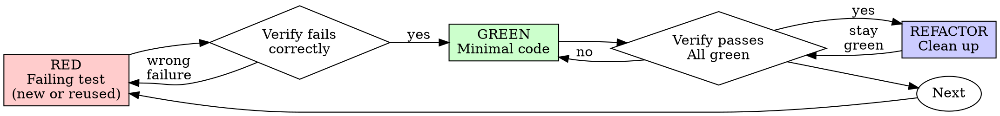

# Test-Driven Development (TDD)

## Flow fit

- **Levels:** B, C, and D - wherever the change is behavior you can assert on automatically. Not A, and not for copy, styling, configuration, or generated output.
- **Lightweight path:** a bug whose failing test already exists - reuse that test as the RED, jump straight to the fix, and re-run it plus the tests around it.
- **Skip when:** the change cannot be verified by a test (prose, styling, config, generated files), or it is a throwaway prototype. Use the honest alternative and say what it does not cover (see *Alternatives When There Is No Behavior To Assert*).
- **Non-negotiables:** never weaken an assertion or delete a test to manufacture a pass; a regression test you did not watch fail proves nothing about the bug it claims to catch.

## Overview

Write the test first. Watch it fail. Write minimal code to pass.

**Core principle:** if you didn't watch the test fail, you don't know if it tests the right thing.

## When to Use

TDD is a tool for behavior, not a gate on all work: it applies to new features, behavior changes, bug fixes, and refactoring that must stay behavior-preserving. Prose, styling, configuration, generated files, and code you cannot exercise have an honest alternative instead - see *Alternatives When There Is No Behavior To Assert* below; "no test is possible" is not the same as "nothing to verify."

**Exceptions that need your human partner's agreement:** throwaway prototypes (delete the throwaway, then TDD the real thing), and code you cannot exercise at all in the current environment. Thinking "skip TDD just this once" on behavior work is still rationalization - check which row you are actually in, don't just reach for the exit.

## The Iron Law

```
NO PRODUCTION CODE WITHOUT A FAILING TEST FIRST
```

Within the behavior work TDD applies to, this is not negotiable: write code before the test and you have thrown away the only proof the test can catch the bug. Delete it and start from the test.

**Don't keep it as "reference":**
- Don't "adapt" it while writing tests
- Don't look at it
- Delete means delete

Implement fresh from tests. Period.

(Reminder: this law scopes to behavior work. Prose, styling, config, and generated files are outside it - they get the alternative verification below, not a fabricated test.)

## Red-Green-Refactor



### RED - Get a Failing Test

Write one minimal test showing what should happen - or reuse the failing test that already does.

<Good>
```typescript
test('retries failed operations 3 times', async () => {
  let attempts = 0;
  const operation = () => {
    attempts++;
    if (attempts < 3) throw new Error('fail');
    return 'success';
  };

  const result = await retryOperation(operation);

  expect(result).toBe('success');
  expect(attempts).toBe(3);
});
```
Clear name, tests real behavior, one thing
</Good>

<Bad>
```typescript
test('retry works', async () => {
  const mock = jest.fn()
    .mockRejectedValueOnce(new Error())
    .mockRejectedValueOnce(new Error())
    .mockResolvedValueOnce('success');
  await retryOperation(mock);
  expect(mock).toHaveBeenCalledTimes(3);
});
```
Vague name, tests mock not code
</Bad>

**Requirements:** one behavior; clear name; real code (no mocks unless unavoidable); written before the implementation.

### Verify RED - Watch It Fail

**Don't skip this.** Watching the failure is what proves the test can catch the bug.

```bash
npm test path/to/test.test.ts
```

Confirm:
- Test fails (not errors)
- Failure message is expected
- Fails because feature missing (not typos)

**Test passes?** You're testing existing behavior. Fix test.

**Test errors?** Fix error, re-run until it fails correctly.

**Reusing an existing failing test?** You already have RED. Confirm it fails for the reason you think before touching the code.

### GREEN - Minimal Code

Write simplest code to pass the test.

<Good>
```typescript
async function retryOperation<T>(fn: () => Promise<T>): Promise<T> {
  for (let i = 0; i < 3; i++) {
    try {
      return await fn();
    } catch (e) {
      if (i === 2) throw e;
    }
  }
  throw new Error('unreachable');
}
```
Just enough to pass
</Good>

<Bad>
```typescript
async function retryOperation<T>(
  fn: () => Promise<T>,
  options?: {
    maxRetries?: number;
    backoff?: 'linear' | 'exponential';
    onRetry?: (attempt: number) => void;
  }
): Promise<T> {
  // YAGNI
}
```
Over-engineered
</Bad>

Don't add features, refactor other code, or "improve" beyond the test.

### Verify GREEN - Watch It Pass

```bash
npm test path/to/test.test.ts
```

Confirm:
- Test passes
- Other tests still pass
- Output pristine (no errors, warnings)

**Test fails?** Fix code, not test.

**Other tests fail?** Fix now.

### REFACTOR - Clean Up

After green only:
- Remove duplication
- Improve names
- Extract helpers

Keep tests green. Don't add behavior.

### Repeat

Next failing test for next feature.

## Good Tests

| Quality | Good | Bad |
|---------|------|-----|
| **Minimal** | One thing. "and" in name? Split it. | `test('validates email and domain and whitespace')` |
| **Clear** | Name describes behavior | `test('test1')` |
| **Shows intent** | Demonstrates desired API | Obscures what code should do |

When writing or changing any test, read [writing-good-tests.md](writing-good-tests.md) for the rules that keep tests honest:
- Name the production change that would make the test fail — before writing it
- Assert on real behavior, never on mock behavior
- Keep test-only code in test utilities, out of production classes
- Understand a dependency's side effects before mocking it

## Alternatives When There Is No Behavior To Assert

A change with no assertable behavior gets the honest alternative, not a fabricated test. A test that only restates the text, or that can only fail when someone edits a deliberate decision, is a change detector: it costs maintenance forever and catches nothing. Verify with the alternative and **say what it does not cover**.

| Change | Alternative verification | What it does not verify |
|--------|--------------------------|-------------------------|
| Copy, comments, docs | Render or read it in context; build if it feeds a build | Anything beyond the text you looked at |
| Styling, layout | Build + static checks + before/after screenshot | Behavior under interaction, edge-case states |
| Configuration, manifests | Schema/key lint, or load and parse it | Values correct for the target environment |
| Generated output | Regenerate and diff the artifact | Hand-written code mixed into the output |
| Hard to automate | A documented manual reproduction: exact steps, observed result | Regression protection - evidence for this run only |

"No test is possible" is never a reason to skip verification, only a reason to name the alternative, say plainly which parts you did not verify, and stop short of claiming behavior that alternative never exercised. If the change later turns out to have assertable behavior, TDD applies to that part after all.

## Reusing a Failing Test

A failing test that already covers the bug is your RED: confirm it fails for the reason you think, then go straight to the fix and back to green - don't rewrite it or write a second one beside it.

**Passing evidence is reusable too**, while the code, dependencies, environment, and versions it covered are unchanged - it survives further messages, not later edits. Re-run only what something invalidates:

- You changed the code the evidence covers
- Dependencies, toolchain, or environment changed, or the version under test changed
- The evidence was partial and you are now claiming more than it supports

To prove a regression test really catches the bug: pass with the fix, revert the fix and watch it fail, restore and watch it pass - stronger than watching it pass once. Scope and validity rules: `superpowers:verification-before-completion`.

## Common Rationalizations

| Excuse | Reality |
|--------|---------|
| "Too simple to test" | Simple behavior breaks. If it is behavior, the test takes 30 seconds. If it is prose or config, it belongs in the alternative path instead. |
| "I'll test after" | Tests written after pass immediately — which proves nothing. They may test the wrong thing, test the implementation instead of the behavior, or miss the edge case you forgot. You never watched it fail, so you never proved it can catch the bug. Test-first forces that failure. |
| "Tests after achieve same goals (spirit not ritual)" | Tests-after answer "what does this do?"; tests-first answer "what should this do?" Tests written after are biased by the code you already wrote — you verify the cases you remembered, not the ones you'd have discovered. Coverage without proof the tests work. |
| "Already manually tested it" | For prose, styling, or config that can be the honest verification — say so and say what it does not cover. For behavior, manual testing is ad-hoc: no record of what you covered, no way to re-run it when the code changes, easy to forget cases under pressure. |
| "Deleting X hours is wasteful" | Sunk cost fallacy — that time is already spent either way. The real choice: rewrite with TDD (high confidence) vs. keep it and bolt tests on after (low confidence, likely bugs). Keeping code you can't trust is the waste. |
| "Keep as reference, write tests first" | You'll adapt it. That's testing after. Delete means delete. |
| "Need to explore first" | Fine. Throw away exploration, start with TDD. |
| "Test hard = design unclear" | Listen to test. Hard to test = hard to use. |
| "TDD will slow me down" | TDD IS the pragmatic path: catches bugs before commit, prevents regressions, lets you refactor without fear. "Pragmatic" shortcuts on behavior work mean debugging in production — slower, not faster. |
| "Existing code has no tests" | You're improving it. Add tests for the behavior you touch. |
| "No test is possible, so nothing to verify" | Different claim. Pick the alternative that actually applies and name what it misses. |
| "This change is prose/config, so the rules don't apply" | Correct — and then the alternative path applies to it. Exempting the change exempts nothing from verification. |

## Red Flags - STOP and Start Over

On behavior work:
- Code before test
- Test after implementation
- Test passes immediately
- Can't explain why test failed
- Tests added "later"
- Rationalizing "just this once"
- "Tests after achieve the same purpose"
- "It's about spirit not ritual"
- "Keep as reference" or "adapt existing code"
- "Already spent X hours, deleting is wasteful"

**On behavior work, these mean: Delete code. Start over with TDD.**

**A fix that failed twice is its own signal:** stop stacking patches and re-investigate with `superpowers:systematic-debugging` - the cause is not what you assumed, and no amount of TDD ceremony on the wrong hypothesis will help.

## Example: Bug Fix

**Bug:** Empty email accepted

**RED**
```typescript
test('rejects empty email', async () => {
  const result = await submitForm({ email: '' });
  expect(result.error).toBe('Email required');
});
```

**Verify RED**
```bash
$ npm test
FAIL: expected 'Email required', got undefined
```

**GREEN**
```typescript
function submitForm(data: FormData) {
  if (!data.email?.trim()) {
    return { error: 'Email required' };
  }
  // ...
}
```

**Verify GREEN**
```bash
$ npm test
PASS
```

**REFACTOR**
Extract validation for multiple fields if needed.

## Verification Checklist

For behavior work, before marking it complete:

- [ ] Every new function/method that has behavior has a test
- [ ] Watched each test fail before implementing - or reused a failing test that already covered the bug
- [ ] Each test failed for expected reason (feature missing, not typo)
- [ ] Wrote minimal code to pass each test
- [ ] The tests around the change pass
- [ ] Output pristine (no errors, warnings)
- [ ] Tests use real code (mocks only if unavoidable)
- [ ] Edge cases and errors covered

Can't check all boxes on behavior work? You skipped TDD. Start over. A change with no assertable behavior is checked instead by the alternative verification it got and what that alternative does not cover.

## When Stuck

| Problem | Solution |
|---------|----------|
| Don't know how to test | Write wished-for API. Write assertion first. Ask your human partner. |
| Test too complicated | Design too complicated. Simplify interface. |
| Must mock everything | Code too coupled. Use dependency injection. |
| Test setup huge | Extract helpers. Still complex? Simplify design. |
| Test can only fail when someone edits a decision | That is a change detector, not a test - assert the behavior that depends on the decision |

## Debugging Integration

Bug found? Check first whether a failing test already reproduces it - reuse that one. Otherwise write it, follow the TDD cycle, and let the test prove the fix and prevent the regression.

Don't fix a behavior bug without a test that fails for it, unless you are on the alternative path and have said what that path leaves unverified.

## Final Rule

```
Behavior work → test exists and failed first (or was already failing)
Non-behavior work → an honest alternative, and what it does not cover
Otherwise → not verified
```

Prototypes and code you genuinely cannot exercise are the exception, with your human partner's agreement.
