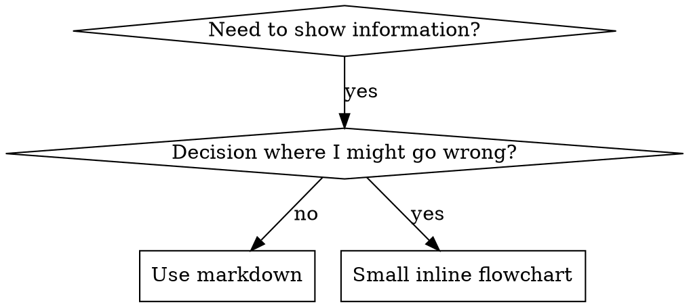

# Writing Skills

## Overview

**Writing skills is Test-Driven Development applied to process documentation — run at the depth the change warrants.**

**Personal skills live in your runtime's skills directory** (`~/.claude/skills/` on Claude Code) — see `using-superpowers/references/codex-tools.md` or `using-superpowers/references/gemini-tools.md` for the path on those runtimes. Codex, Copilot CLI, and Gemini CLI all also recognize `~/.agents/skills/` as a cross-runtime alias.

You write test cases (pressure scenarios with subagents), watch them fail (baseline behavior), write the skill (documentation), watch tests pass (agents comply), and refactor (close loopholes) — **when the change can shape behavior**. Not every edit is a campaign. A wording fix, a stale path, a deleted paragraph, or a reference reorg earns a targeted behavioral check; content that governs what an agent does under pressure earns the full cycle. Scale the process to the risk, the same way `superpowers:using-superpowers` scales task levels.

**Core principle for behavior-shaping content:** If you didn't watch an agent fail without the skill, you don't know if the skill teaches the right thing.

**Deleting burden is legitimate.** Removing a requirement that does not change agent behavior is a valid and valuable edit — see [Deleting Process Burden](#deleting-process-burden). The one thing that never gets dropped is verification of the behavior the skill is actually responsible for.

**Background, on demand:** read superpowers:test-driven-development when you need the RED-GREEN-REFACTOR cycle in detail; this skill adapts that cycle to documentation.

**Official guidance:** For Anthropic's official skill authoring best practices, see anthropic-best-practices.md. This document provides additional patterns and guidelines that complement the TDD-focused approach in this skill.

## Flow fit

- **Levels:** classify the edit with `superpowers:using-superpowers` — A (typo, format, link) owes no behavioral claim; B gets one targeted before/after comparison; C/D, behavior-shaping, safety-relevant, or unpredictable edits get RED-GREEN-REFACTOR.
- **Lightweight path:** for a change that cannot alter behavior — confirm nothing references what you touched, run one baseline plus one post-change check, record input and output, ship.
- **Skip when:** you are only fixing typos, formatting, links, or deleting an unused section. No behavioral claim is being made, so no behavioral test is owed.
- **Non-negotiables:** never claim a behavioral effect you did not observe; never delete tests, weaken assertions, or swallow failures to manufacture green; authorization and risk controls do not shrink with the level.

## Deleting Process Burden

Skills are tools loaded on demand. Every line competes for context and attention, and a rule that does not change what an agent does is pure cost.

**Deleting a requirement that does not change behavior is a legitimate and valuable edit** — as valuable as adding one that does. Authors are expected to cut, not just accumulate.

**Delete these:**
- Long templates and boilerplate sections that get skimmed or skipped
- Repeated confirmations of something the request, the code, or an earlier section already answers
- Ceremonial steps kept "for completeness" — a checklist item, a mandatory announcement, a per-item todo, a fixed sequence nobody deviates from
- Decorative wording, restated principles, and hedges that do not alter a decision
- Assertions about procedure that no observed agent behavior depends on

**The test for keeping a line:** does it change what an agent actually does — a choice, an ordering, a stop condition, an output shape? If you cannot name the behavior it changes, it is a candidate for deletion.

**The floor:** deletion still has to preserve behavior verification for whatever the skill is responsible for, plus the risk controls and authorization boundaries that apply. Deleting a test, weakening an assertion, or removing a safety rule to make a change look clean is not burden reduction — that is green-washing. If you are unsure whether behavior depends on a line, run one comparison instead of arguing about it.

## What is a Skill?

A **skill** is a reference guide for proven techniques, patterns, or tools. Skills help future agents find and apply effective approaches.

**Skills are:** Reusable techniques, patterns, tools, reference guides

**Skills are NOT:** Narratives about how you solved a problem once

## TDD Mapping for Skills

| TDD Concept | Skill Creation |
|-------------|----------------|
| **Test case** | Pressure scenario with subagent |
| **Production code** | Skill document (SKILL.md) |
| **Test fails (RED)** | Agent violates rule without skill (baseline) |
| **Test passes (GREEN)** | Agent complies with skill present |
| **Refactor** | Close loopholes while maintaining compliance |
| **Write test first** | Run baseline scenario BEFORE writing skill |
| **Watch it fail** | Document exact rationalizations agent uses |
| **Minimal code** | Write skill addressing those specific violations |
| **Watch it pass** | Verify agent now complies |
| **Refactor cycle** | Find new rationalizations → plug → re-verify |

The mapping applies to the part of a skill that shapes behavior. Reference content, formatting, and deletions with no behavioral claim do not map onto a test at all — there is nothing for RED to fail.

## When to Create a Skill

**Create when:**
- Technique wasn't intuitively obvious to you
- You'd reference this again across projects
- Pattern applies broadly (not project-specific)
- Others would benefit

**Don't create for:**
- One-off solutions
- Standard practices well-documented elsewhere
- Project-specific conventions (put in your instructions file)
- Mechanical constraints (if it's enforceable with regex/validation, automate it—save documentation for judgment calls)

## Skill Types

### Technique
Concrete method with steps to follow (condition-based-waiting, root-cause-tracing)

### Pattern
Way of thinking about problems (flatten-with-flags, test-invariants)

### Reference
API docs, syntax guides, tool documentation (office docs)

## Directory Structure


```
skills/
  skill-name/
    SKILL.md              # Main reference (required)
    supporting-file.*     # Only if needed
```

**Flat namespace** - all skills in one searchable namespace

**Separate files for:**
1. **Heavy reference** (100+ lines) - API docs, comprehensive syntax
2. **Reusable tools** - Scripts, utilities, templates

**Keep inline:**
- Principles and concepts
- Code patterns (< 50 lines)
- Everything else

## SKILL.md Structure

**Frontmatter (YAML):**
- Two required fields: `name` and `description` (see [agentskills.io/specification](https://agentskills.io/specification) for all supported fields)
- Max 1024 characters total
- `name`: Use letters, numbers, and hyphens only (no parentheses, special chars)
- `description`: Third-person, describes ONLY when to use (NOT what it does)
  - Start with "Use when..." to focus on triggering conditions
  - Include specific symptoms, situations, and contexts
  - **NEVER summarize the skill's process or workflow** (see SDO section for why)
  - Keep under 500 characters if possible

```markdown
---
name: Skill-Name-With-Hyphens
description: Use when [specific triggering conditions and symptoms]
---

# Skill Name

## Overview
What is this? Core principle in 1-2 sentences.

## When to Use
[Small inline flowchart IF decision non-obvious]

Bullet list with SYMPTOMS and use cases
When NOT to use

## Core Pattern (for techniques/patterns)
Before/after code comparison

## Quick Reference
Table or bullets for scanning common operations

## Implementation
Inline code for simple patterns
Link to file for heavy reference or reusable tools

## Common Mistakes
What goes wrong + fixes

## Real-World Impact (optional)
Concrete results
```


## Skill Discovery Optimization (SDO)

**Critical for discovery:** Future agents need to FIND your skill

### 1. Rich Description Field

**Purpose:** Your agent reads the description to decide which skills to load for a given task. Make it answer: "Should I read this skill right now?"

**Format:** Start with "Use when..." to focus on triggering conditions

**CRITICAL: Description = When to Use, NOT What the Skill Does**

The description should ONLY describe triggering conditions. Do NOT summarize the skill's process or workflow in the description.

**Why this matters:** Testing revealed that when a description summarizes the skill's workflow, an agent may follow the description instead of reading the full skill content. A description saying "code review between tasks" caused an agent to do ONE review, even though the skill's flowchart clearly showed TWO reviews (spec compliance then code quality).

When the description was changed to just "Use when executing implementation plans with independent tasks" (no workflow summary), the agent correctly read the flowchart and followed the two-stage review process.

**The trap:** Descriptions that summarize workflow create a shortcut agents will take. The skill body becomes documentation agents skip.

```yaml
# ❌ BAD: Summarizes workflow - agents may follow this instead of reading skill
description: Use when executing plans - dispatches subagent per task with code review between tasks

# ❌ BAD: Too much process detail
description: Use for TDD - write test first, watch it fail, write minimal code, refactor

# ✅ GOOD: Just triggering conditions, no workflow summary
description: Use when executing implementation plans with independent tasks in the current session

# ✅ GOOD: Triggering conditions only
description: Use when implementing any feature or bugfix, before writing implementation code
```

**Content:**
- Use concrete triggers, symptoms, and situations that signal this skill applies
- Describe the *problem* (race conditions, inconsistent behavior) not *language-specific symptoms* (setTimeout, sleep)
- Keep triggers technology-agnostic unless the skill itself is technology-specific
- If skill is technology-specific, make that explicit in the trigger
- Write in third person (injected into system prompt)
- **NEVER summarize the skill's process or workflow**

```yaml
# ❌ BAD: Too abstract, vague, doesn't include when to use
description: For async testing

# ❌ BAD: First person
description: I can help you with async tests when they're flaky

# ❌ BAD: Mentions technology but skill isn't specific to it
description: Use when tests use setTimeout/sleep and are flaky

# ✅ GOOD: Starts with "Use when", describes problem, no workflow
description: Use when tests have race conditions, timing dependencies, or pass/fail inconsistently

# ✅ GOOD: Technology-specific skill with explicit trigger
description: Use when using React Router and handling authentication redirects
```

### 2. Keyword Coverage

Use words an agent would search for:
- Error messages: "Hook timed out", "ENOTEMPTY", "race condition"
- Symptoms: "flaky", "hanging", "zombie", "pollution"
- Synonyms: "timeout/hang/freeze", "cleanup/teardown/afterEach"
- Tools: Actual commands, library names, file types

### 3. Descriptive Naming

**Use active voice, verb-first, and name by what you DO or by the core insight:**
- ✅ `creating-skills` not `skill-creation`
- ✅ `condition-based-waiting` not `async-test-helpers`
- ✅ `flatten-with-flags` > `data-structure-refactoring`
- ✅ `root-cause-tracing` > `debugging-techniques`

**Gerunds (-ing) work well for processes:** `creating-skills`, `testing-skills`, `debugging-with-logs` — active, describes the action you're taking.

### 4. Token Efficiency (Critical)

**Problem:** getting-started and frequently-referenced skills load into EVERY conversation. Every token counts.

**Target word counts:**
- getting-started workflows: <150 words each
- Frequently-loaded skills: <200 words total
- Other skills: <500 words (still be concise)

**Techniques:**

**Move details to tool help:**
```bash
# ❌ BAD: Document all flags in SKILL.md
search-conversations supports --text, --both, --after DATE, --before DATE, --limit N

# ✅ GOOD: Reference --help
search-conversations supports multiple modes and filters. Run --help for details.
```

**Use cross-references:**
```markdown
# ❌ BAD: Repeat workflow details
When searching, dispatch subagent with template...
[20 lines of repeated instructions]

# ✅ GOOD: Reference other skill
Use subagents where they save context (50-100x) and the work is independent. Use [other-skill-name] when its workflow applies.
```

**Compress examples:**
```markdown
# ❌ BAD: Verbose example (42 words)
your human partner: "How did we handle authentication errors in React Router before?"
You: I'll search past conversations for React Router authentication patterns.
[Dispatch subagent with search query: "React Router authentication error handling 401"]

# ✅ GOOD: Minimal example (20 words)
Partner: "How did we handle auth errors in React Router?"
You: Searching...
[Dispatch subagent → synthesis]
```

**Eliminate redundancy:**
- Don't repeat what's in cross-referenced skills
- Don't explain what's obvious from command
- Don't include multiple examples of same pattern

**Verification:**
```bash
wc -w skills/path/SKILL.md
# getting-started workflows: aim for <150 each
# Other frequently-loaded: aim for <200 total
```

### 5. Cross-Referencing Other Skills

**When writing documentation that references other skills:**

Name the skill and say **when** it applies, so the reader can decide whether to load it:
- ✅ Good: `Use superpowers:test-driven-development when the cycle is not already familiar`
- ✅ Good: `Use superpowers:systematic-debugging when the cause is still unknown`
- ✅ Good: `superpowers:test-driven-development defines the RED-GREEN-REFACTOR cycle this skill adapts`
- ❌ Bad: `**REQUIRED SUB-SKILL:** Use superpowers:systematic-debugging` (an unconditional marker makes an on-demand tool a gate)
- ❌ Bad: `See skills/testing/test-driven-development` (unclear whether, or when, to load it)
- ❌ Bad: `@skills/testing/test-driven-development/SKILL.md` (force-loads, burns context)

Reserve unconditional "REQUIRED" markers for dependencies that genuinely apply every time. A marker that fires on every task turns an on-demand tool back into a gate.

**Why no @ links:** `@` syntax force-loads files immediately, consuming 200k+ context before you need them.

## Flowchart Usage



**Use flowcharts ONLY for:**
- Non-obvious decision points
- Process loops where you might stop too early
- "When to use A vs B" decisions

**Never use flowcharts for:**
- Reference material → Tables, lists
- Code examples → Markdown blocks
- Linear instructions → Numbered lists
- Labels without semantic meaning (step1, helper2)

See `graphviz-conventions.dot` in this directory for graphviz style rules.

**Visualizing for your human partner:** Use `render-graphs.js` in this directory to render a skill's flowcharts to SVG:
```bash
./render-graphs.js ../some-skill           # Each diagram separately
./render-graphs.js ../some-skill --combine # All diagrams in one SVG
```

## Code Examples

**One excellent example beats many mediocre ones**

Choose most relevant language:
- Testing techniques → TypeScript/JavaScript
- System debugging → Shell/Python
- Data processing → Python

**Good example:**
- Complete and runnable
- Well-commented explaining WHY
- From real scenario
- Shows pattern clearly
- Ready to adapt (not generic template)

**Don't:**
- Implement in 5+ languages
- Create fill-in-the-blank templates
- Write contrived examples

You're good at porting - one great example is enough.

## File Organization

### Self-Contained Skill
```
defense-in-depth/
  SKILL.md    # Everything inline
```
When: All content fits, no heavy reference needed

### Skill with Reusable Tool
```
condition-based-waiting/
  SKILL.md    # Overview + patterns
  example.ts  # Working helpers to adapt
```
When: Tool is reusable code, not just narrative

### Skill with Heavy Reference
```
pptx/
  SKILL.md       # Overview + workflows
  pptxgenjs.md   # 600 lines API reference
  ooxml.md       # 500 lines XML structure
  scripts/       # Executable tools
```
When: Reference material too large for inline

## The Iron Law, Scaled

```
NO BEHAVIOR-SHAPING CHANGE WITHOUT BEHAVIORAL EVIDENCE
```

The law is about the *claim*, not the file. Before you edit, ask what this change can make an agent do differently. That answer sets the evidence owed:

| Change | Evidence owed |
|---|---|
| Typo, formatting, path or link fix, or deleting a section nothing depends on | None beyond confirming nothing references what you touched. No behavioral claim is being made. |
| Wording correction where the intended behavior is already clear | One comparison: same input against the old and new text, then read both outputs. |
| Behavior-shaping content (rules, prohibitions, recipes, red flags, rationalization counters) | Baseline scenario first, then the same scenario with the change, plus a no-guidance control. |
| Safety-relevant, discipline-enforcing, or an edit whose effect you cannot predict | Full RED-GREEN-REFACTOR with pressure scenarios and repetition. |

Writing guidance before watching the failure means you are guessing at what needs preventing. Delete the guess and start from the baseline — for the rows where behavior is what changes.

**Same rule for edits as for new skills.** An edit that changes behavior is a new claim about behavior. An edit that does not change behavior owes no behavioral test at all.

**Background, on demand:** The superpowers:test-driven-development skill explains why the failing test comes first; read it when you need that reasoning in full.

## Testing All Skill Types

Different skill types need different test approaches — and different depths. The lists below describe a full run for behavior-shaping content; a one-line correction inside any of these types needs only the single comparison from The Iron Law, Scaled.

For every type the same floor applies: you can say what a fresh agent did before the change and what it did after, with the inputs recorded.

### Discipline-Enforcing Skills (rules/requirements)

**Examples:** TDD, verification-before-completion, designing-before-coding

**Test with:**
- Academic questions: Do they understand the rules?
- Pressure scenarios: Do they comply under stress?
- Multiple pressures combined: time + sunk cost + exhaustion
- Identify rationalizations and add explicit counters

**Success criteria:** Agent follows rule under maximum pressure

### Technique Skills (how-to guides)

**Examples:** condition-based-waiting, root-cause-tracing, defensive-programming

**Test with:**
- Application scenarios: Can they apply the technique correctly?
- Variation scenarios: Do they handle edge cases?
- Missing information tests: Do instructions have gaps?

**Success criteria:** Agent successfully applies technique to new scenario

### Pattern Skills (mental models)

**Examples:** reducing-complexity, information-hiding concepts

**Test with:**
- Recognition scenarios: Do they recognize when pattern applies?
- Application scenarios: Can they use the mental model?
- Counter-examples: Do they know when NOT to apply?

**Success criteria:** Agent correctly identifies when/how to apply pattern

### Reference Skills (documentation/APIs)

**Examples:** API documentation, command references, library guides

**Test with:**
- Retrieval scenarios: Can they find the right information?
- Application scenarios: Can they use what they found correctly?
- Gap testing: Are common use cases covered?

**Success criteria:** Agent finds and correctly applies reference information

## Rationalizations, Sorted

Some of these excuses are real mistakes. Others are correct calls on low-risk edits that the old framing treated as violations. Sort them by **whether the change can alter behavior**:

| Excuse | Verdict |
|--------|---------|
| "It's only a typo / a dead link / a deleted unused section" | **Legitimate for A/B edits.** No behavioral claim, no behavioral test. Confirm nothing references what you removed. |
| "It's just a reference" | **Half legitimate.** Reference edits still get a retrieval check — can a fresh agent find and apply the right section? |
| "I'm confident it's good" | **Not legitimate for behavior-shaping content.** Confidence is not observation. Run the comparison. |
| "Testing is overkill" | **Depends on the change.** True for formatting; false for a rule an agent will rationalize away under pressure. |
| "I'll test if problems emerge" | **Not legitimate for C/D.** Problems surface as agents doing the wrong thing, which is exactly what the test prevents. |
| "Reading it over is enough" | **Only when no behavior is claimed.** Reading ≠ using; a text review cannot stand in for watching an agent act. |
| "No time to test" | **Escalate to your human partner rather than silently skipping.** Say what you did not verify and why. |

**Deleting or deferring a requirement is a violation only when behavior depended on it.** Say which behavior, or say you checked and found none.

## Match the Form to the Failure

Before writing guidance, classify the baseline failure. The form that bulletproofs one failure type measurably backfires on another.

| Baseline failure | Right form | Wrong form |
|---|---|---|
| Skips/violates a rule under pressure (knows better, does it anyway) | Prohibition + rationalization table + red flags (see Bulletproofing below) | Soft guidance ("prefer...", "consider...") |
| Complies, but output has the wrong shape (bloated prompt, buried verdict, restated spec) | Positive recipe or contract: state what the output IS — its parts, in order | Prohibition list ("don't restate", "never narrate") |
| Omits a required element from something they already produce | Structural: REQUIRED field or slot in the template they fill in | Prose reminders near the template |
| Behavior should depend on a condition | Conditional keyed to an observable predicate ("if the brief exists, reference it") | Unconditional rule + exemption clauses |

**Why prohibitions backfire on shaping problems:** under a competing incentive ("make the prompt self-contained"), agents negotiate with "don't X". In head-to-head wording tests on dispatch-prompt guidance, the prohibition arm produced clearly more of the unwanted content than the recipe arm (fully separated distributions), and trended worse than even the no-guidance control — micro-test your own case rather than assuming, but never reach for the prohibition by default. A recipe leaves nothing to negotiate: the output matches the stated shape or it doesn't.

**Rules for whichever form you pick:**
- **No nuance clauses.** "Don't X unless it matters" reopens the negotiation — appending a single nuance clause to a winning recipe degraded it from consistent to noisy in the same wording tests. Express a real exception as its own conditional on an observable predicate.
- **Exemption clauses don't scope.** "This limit doesn't apply to code blocks" still suppresses code blocks. If part of the output must be exempt, restructure so the rule can't reach it.

## Bulletproofing Skills Against Rationalization

Skills that enforce discipline (like TDD) need to resist rationalization. Agents are smart and will find loopholes when under pressure.

**Scope:** this toolkit is for discipline failures — an agent that knows the rule and skips it under pressure. For wrong-shaped output or omitted elements, prohibition-based bulletproofing backfires; use the forms in Match the Form to the Failure instead.

**Risk scope:** red flags and rationalization tables are worth their length only where an agent has an incentive to talk itself out of the rule. A typo fix, a clarity edit, or a reference update adds none of this machinery — one comparison settles it. Adding a red flags list to content nobody resists is exactly the decorative burden Deleting Process Burden tells you to cut.

**Psychology note:** Understanding WHY persuasion techniques work helps you apply them systematically. See persuasion-principles.md for research foundation (Cialdini, 2021; Meincke et al., 2025) on authority, commitment, scarcity, social proof, and unity principles.

### Close Every Loophole Explicitly

Don't just state the rule - forbid specific workarounds:

<Bad>
```markdown
Write code before test? Delete it.
```
</Bad>

<Good>
```markdown
Write code before test? Delete it. Start over.

**No exceptions:**
- Don't keep it as "reference"
- Don't "adapt" it while writing tests
- Don't look at it
- Delete means delete
```
</Good>

### Address "Spirit vs Letter" Arguments

Add foundational principle early:

```markdown
**Violating the letter of the rules is violating the spirit of the rules.**
```

This cuts off entire class of "I'm following the spirit" rationalizations.

### Build Rationalization Table

Capture rationalizations from baseline testing (see Testing section below). Every excuse agents make goes in the table:

```markdown
| Excuse | Reality |
|--------|---------|
| "Too simple to test" | Simple code breaks. Test takes 30 seconds. |
| "I'll test after" | Tests passing immediately prove nothing. |
| "Tests after achieve same goals" | Tests-after = "what does this do?" Tests-first = "what should this do?" |
```

### Create Red Flags List

Make it easy for agents to self-check when rationalizing:

```markdown
## Red Flags - STOP and Start Over

- Code before test
- "I already manually tested it"
- "Tests after achieve the same purpose"
- "It's about spirit not ritual"
- "This is different because..."

**All of these mean: Delete code. Start over with TDD.**
```

### Update SDO for Violation Symptoms

Add to description: symptoms of when you're ABOUT to violate the rule:

```yaml
description: use when implementing any feature or bugfix, before writing implementation code
```

## RED-GREEN-REFACTOR for Skills

Run this cycle for behavior-shaping changes, at the depth the change warrants (see the table in The Iron Law, Scaled). Start from failure, not from success: the scenario you build is the one where an agent does the wrong thing.

### Minimal verification recipe

The floor for any change that claims a behavioral effect — one baseline, one comparison, recorded evidence:

1. **Failure scenario first (RED).** Give a fresh-context subagent the realistic task the skill is meant to influence, running the **no-guidance control** (no skill, or the old text). Record what it actually does — the choice it makes and the rationalization in its own words. If the control already behaves correctly, there is nothing to fix: stop, and don't author the guidance.
2. **Counter-example check.** Name the case where the opposite would be wrong, and confirm the new wording does not push the agent into it. Guidance that fixes the failure by over-correcting has traded one defect for another.
3. **Apply the change (GREEN).** Run the *same* input against the new text. Same task, same pressures, same framing — otherwise you compared two different experiments.
4. **Record the pair.** Input, both outputs, and the specific difference. "It seemed clearer" is not a record.

### Text checks are not behavior verification

Reading the skill and agreeing with it, passing a link or lint check, `wc -w` on the file, and a model reciting the rule back to you all measure the **text**, not the behavior. They are cheap and worth running. They do not substitute for steps 1–4 whenever a behavioral claim is being made. A perfectly worded rule that agents still talk themselves out of has failed its test.

### RED: Write Failing Test (Baseline)

Run pressure scenario with subagent WITHOUT the skill. Document exact behavior:
- What choices did they make?
- What rationalizations did they use (verbatim)?
- Which pressures triggered violations?

This is "watch the test fail" - you must see what agents naturally do before writing the skill.

### GREEN: Write Minimal Skill

Write skill that addresses those specific rationalizations. Don't add extra content for hypothetical cases.

Run same scenarios WITH skill. Agent should now comply.

### REFACTOR: Close Loopholes

Agent found new rationalization? Add explicit counter. Re-test.

Continue the loop while new rationalizations keep appearing — that is required for discipline-enforcing content. A wording correction that already converged after one comparison is done; there is no benefit in manufacturing more rounds.

### Micro-Test Wording Before Full Scenarios

Full pressure-scenario runs are the final gate, but they are slow and expensive per iteration. Verify the wording itself first with micro-tests:

1. **One fresh-context sample per call** — a raw API call, or a single-shot subagent if you don't have API access. System prompt = the realistic context the guidance will live in (the full skill or prompt template, not the guidance in isolation); user message = a task that tempts the failure.
2. **Always include a no-guidance control.** If the control doesn't exhibit the failure, there is nothing to fix — stop, don't author the guidance.
3. **5+ reps per variant.** Single samples lie.
4. **Manually read every flagged match.** Score programmatically if you like, but template echoes and quoted counter-examples masquerade as hits; automated counts alone overstate both failure and success.
5. **Variance is a metric.** When guidance lands, reps converge on the same shape. Five different interpretations across five reps means the wording isn't binding — tighten the form before adding words.

Micro-tests verify wording; they do not replace pressure scenarios for discipline skills. For a low-risk wording correction, one micro-test comparison **is** the evidence the Iron Law table asks for — you do not need the pressure matrix on top of it.

**Testing methodology:** See [testing-skills-with-subagents.md](testing-skills-with-subagents.md) for the complete testing methodology:
- How to write pressure scenarios
- Pressure types (time, sunk cost, authority, exhaustion)
- Plugging holes systematically
- Meta-testing techniques

## Anti-Patterns

### ❌ Narrative Example
"In session 2025-10-03, we found empty projectDir caused..."
**Why bad:** Too specific, not reusable

### ❌ Multi-Language Dilution
example-js.js, example-py.py, example-go.go
**Why bad:** Mediocre quality, maintenance burden

### ❌ Code in Flowcharts
```dot
step1 [label="import fs"];
step2 [label="read file"];
```
**Why bad:** Can't copy-paste, hard to read

### ❌ Generic Labels
helper1, helper2, step3, pattern4
**Why bad:** Labels should have semantic meaning

## Sequencing the Work

**One behavior-shaping change at a time.** If two edits could each change behavior, verify them separately — otherwise a failure points at two possible causes and you learn nothing.

- Don't stack behavior-shaping edits onto an unverified change
- Don't start the next one before the current claim is settled

**Batching is fine where no behavioral claim is made.** Typos, formatting, link fixes, and deletions of unused content can go in one pass; there is nothing to attribute a failure to.

Deploying behavior-shaping content you never watched an agent use = deploying untested code.

## Skill Authoring Checklist (Scaled)

Apply the rows that match the change. A checklist row that cannot change an outcome is decoration — delete it, or say why it is there. Track the rows with todos only when the tracking itself helps; there is no standing requirement to create a todo per item.

**Always — any skill edit:**
- [ ] Name uses only letters, numbers, hyphens (no parentheses/special chars)
- [ ] YAML frontmatter with required `name` and `description` fields (max 1024 chars; see [spec](https://agentskills.io/specification))
- [ ] Description starts with "Use when..." and states triggering conditions/symptoms, not the workflow
- [ ] Description written in third person
- [ ] Keywords throughout for search (errors, symptoms, tools)
- [ ] Supporting files only for tools or heavy reference
- [ ] Nothing referenced by the section you removed or renamed is now dangling

**When the change can shape behavior (C/D):**
- [ ] RED: create the failing scenario, run it WITHOUT the skill, document baseline behavior verbatim
- [ ] Identify the pattern in the failures — which rationalizations recur?
- [ ] Check the counter-example: does the new wording over-correct into a new failure?
- [ ] Address those specific baseline failures, and nothing hypothetical
- [ ] Guidance form matches the failure type (see Match the Form to the Failure)
- [ ] Micro-test the wording against a no-guidance control (5+ reps; read every flagged match manually)
- [ ] GREEN: run the same scenarios WITH the skill; agents now comply
- [ ] REFACTOR: add explicit counters for NEW rationalizations; update the rationalization table and red flags
- [ ] Re-test after each counter; stop when no new rationalization appears

**Presentation — only where it helps a reader:**
- [ ] Small flowchart, only if the decision is non-obvious
- [ ] Quick reference table
- [ ] Common mistakes section
- [ ] No narrative storytelling
- [ ] One excellent example (not multi-language)

**Deployment:**
- [ ] Commit skill to git and push to your fork (if configured)
- [ ] Consider contributing back via PR (if broadly useful)

## Discovery Workflow

How future agents find your skill:

1. **Encounters problem** ("tests are flaky")
2. **Searches skills** (greps descriptions, browses categories)
3. **Finds SKILL** (description matches)
4. **Scans overview** (is this relevant?)
5. **Reads patterns** (quick reference table)
6. **Loads example** (only when implementing)

**Optimize for this flow** - put searchable terms early and often.
